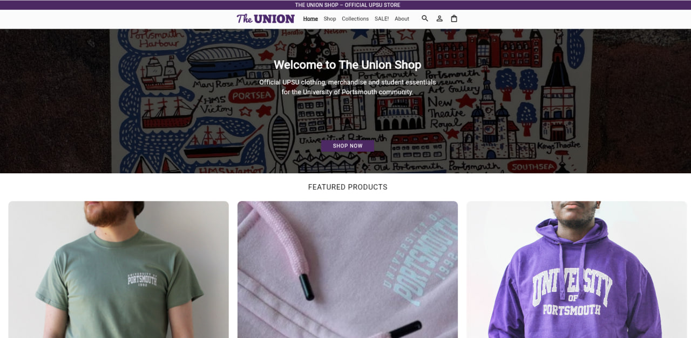
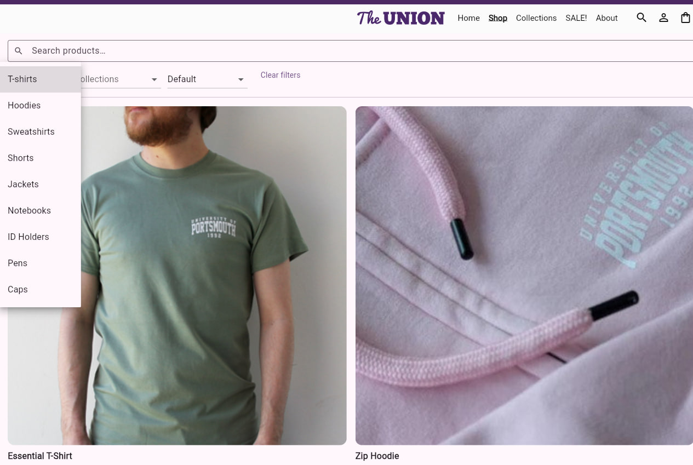
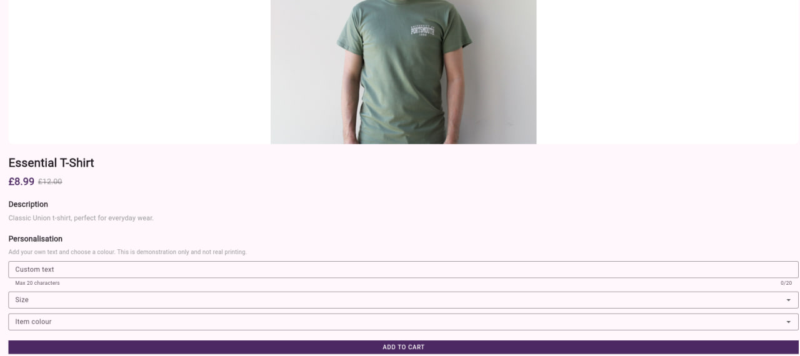
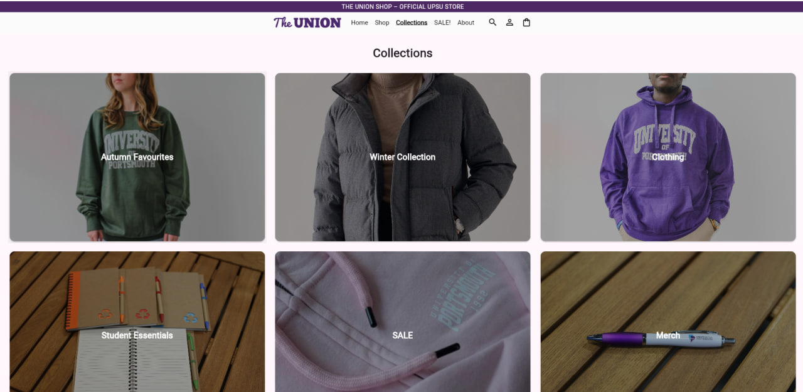
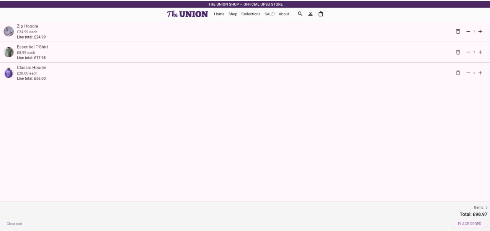
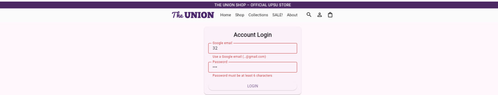
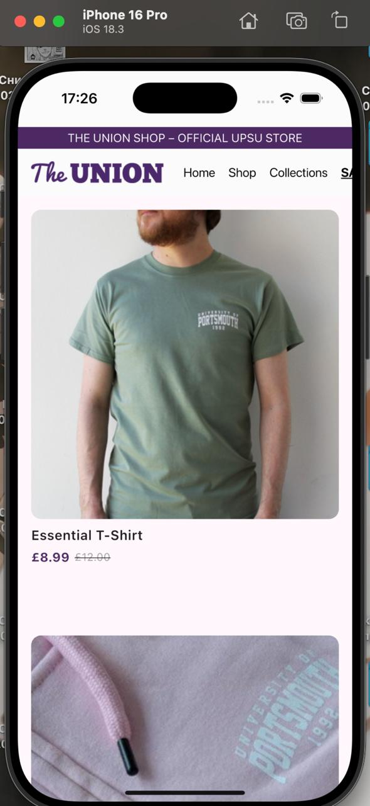

# The Union Shop — Flutter Coursework Project
## made by Sanzhar Kozhobekov

A fully functional coursework version of **The Union Shop** for the University of Portsmouth Students’ Union (UPSU).  
This project replicates the look and feel of the real UPSU shop, including product browsing, filters, collections, cart system, and a simple mock authentication flow.

---

## Features Overview

- Full product catalogue with categories, tags, and collections  
- Product filtering (category, collections, search, sorting)  
- Product details with images, clothing size selection, and optional personalisation  
- Featured products and hero section on the homepage  
- Shopping cart with quantity management and totals  
- Simple mock authentication system (Google-email based)  
- Collection browsing page  
- Responsive layout for desktop, tablet, and mobile  
- Flutter web + Flutter mobile compatible  

---

## Screenshots

### Home Page


### Shop with Filters


### Product Page


### Collections Page


### Cart Page


### Login Page


### Mobile View

---

## Installation & Setup

### **Prerequisites**
Make sure you have installed:

- Flutter SDK (3.x recommended)  
- Dart SDK (included with Flutter)  
- Android Studio or Xcode (for device emulation)  
- Chrome browser (for Flutter Web)

Check your installation:

```sh
flutter doctor
```

---

## Clone the Repository

```sh
git clone https://github.com/knzshka/union_shop.git
cd union_shop
```
---
## Dependencies

```sh
flutter pub get
```
---

## Running the Project

### **Run on Web**
```sh
flutter run -d chrome
```

### **Run on iOS Simulator**
```sh
open -a Simulator
flutter devices
flutter run -d <device_id>
```


## Usage Instructions

### Browsing Products
- Go to **Shop** to view all items  
- Use **category**, **collections**, **sorting**, and **search** filters  
- Tap any product to open its detailed page  

### Product Details
- Clothing products allow selecting:
  - **Size** (S, M, L)
  - **Colour**
  - **Optional personalised text**  
- Add items to the cart with a single button tap  

### Cart System
- Increase/decrease quantity  
- Remove items  
- Clear cart  
- Cart total updates automatically  

### Authentication
A mock auth system:
- Accepts only Google emails (`@gmail.com`)
- Requires a 6+ character password  
- No real database or server — all local state  

### Collections Page
Browse grouped items:
- Autumn Favourites  
- Winter Collection  
- Clothing  
- Student Essentials  
- SALE  
- Merch  

---

## Project Structure

```
lib/
│
├── models/
│   ├── product.dart
│
├── pages/
│   ├── shop_page.dart
│   ├── product_page.dart
│   ├── sale_page.dart
│   ├── cart_page.dart
│   ├── login_page.dart
│   ├── about_page.dart
│   └── collections_page.dart
│
├── services/
│   ├── product_service.dart
│   ├── cart_service.dart
│   └── auth_service.dart
│
├── widgets/
│   ├── app_navbar.dart
│   └── product_card.dart
│
└── main.dart
```

---

## Technologies Used

- **Flutter** (UI framework)  
- **Dart** (programming language)  
- **Material Design**  
- Local in-memory services (mock backend)  
- Responsive layout principles  

---

## Known Issues / Limitations

- Authentication is mock-only (no Firebase/real backend)  
- No persistent storage — cart resets on reload  
- Image layout may vary on small screens depending on aspect ratios  
- This app is NOT intended for production use  

---

## Coursework Notes

This project satisfies the following coursework components:

- Product catalogue system  
- Shopping cart  
- Filtering & collections  
- Mock authentication  
- Responsive interface  
- Navigation across multiple pages  

---


